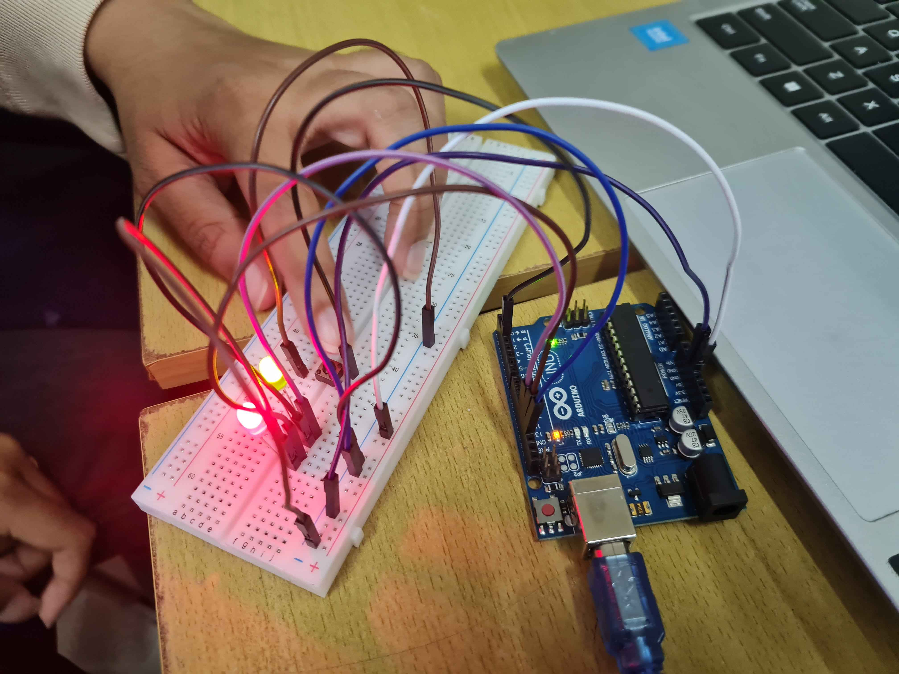
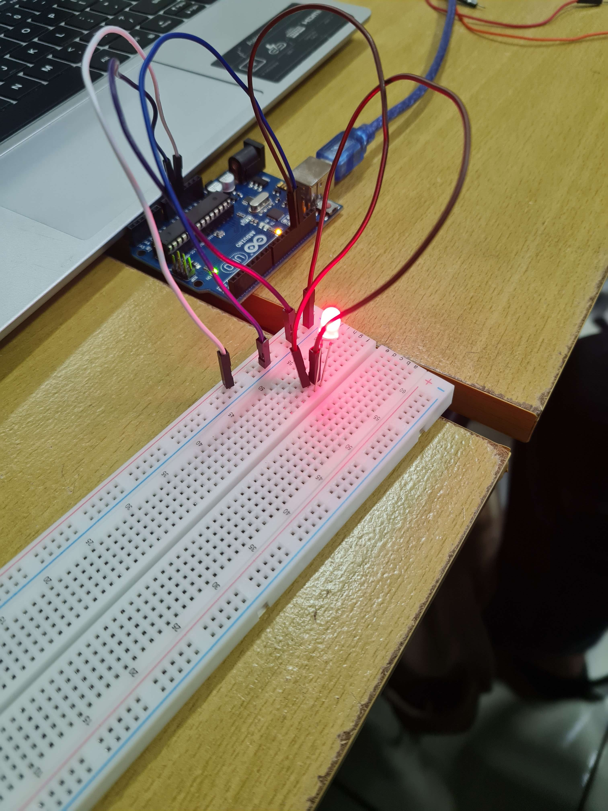
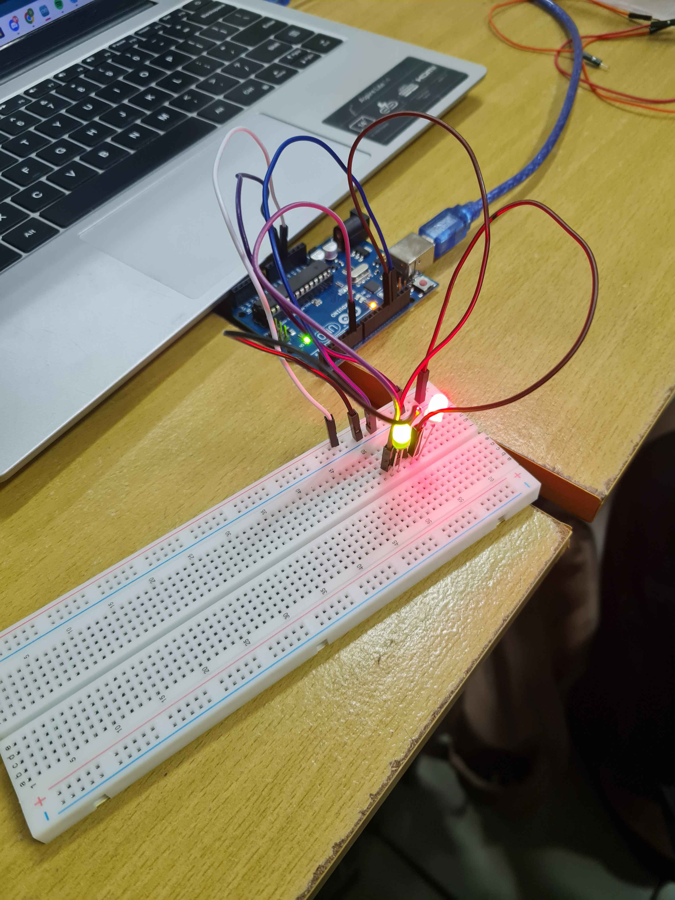

# Pertemuan 6

## 6.5.4 Percobaan 6A: External Interrupt (Kendali LED dengan Tombol)

1. Jelaskan proses bagaimana tombol dapat mengubah kondisi LED menggunakan interrupt!

> - JTombol dihubungkan ke pin 2 dengan mode INPUT_PULLUP. Saat tombol tidak ditekan, pin 2 membaca HIGH (karena terhubung ke 5V via resistor internal). Saat tombol ditekan, pin 2 terhubung ke GND sehingga membaca LOW → terjadi transisi dari HIGH ke LOW (falling edge).
> - Interrupt dengan mode FALLING sudah didaftarkan menggunakan attachInterrupt(). Ketika transisi tersebut terdeteksi, mikrokontroler langsung menghentikan program utama (loop()) dan melompat ke fungsi ISR (tombolInterrupt()).
> - Di dalam ISR, variabel ledState dibalik nilainya (!ledState). Setelah ISR selesai, program utama dilanjutkan.
> - Di loop(), nilai ledState terus ditulis ke pin LED (13 dan 12). Karena ISR mengubah ledState setiap tombol ditekan, LED berubah nyala/mati secara instan.


2. Apa fungsi attachInterrupt() pada program tersebut?

> Fungsi attachInterrupt() digunakan untuk menghubungkan pin interrupt dengan fungsi ISR serta menentukan mode pemicu. Format: attachInterrupt(digitalPinToInterrupt(pin), ISR, mode). Pada program, digitalPinToInterrupt(2) mengonversi pin 2 menjadi nomor interrupt 0, tombolInterrupt adalah nama fungsi ISR, dan FALLING adalah mode pemicu (tekan tombol).


3. Mengapa pada ISR tidak disarankan menggunakan delay() dan Serial.print()?

> ISR harus dieksekusi sesingkat mungkin karena selama ISR berjalan, interrupt lain ditunda dan program utama tidak berjalan. delay() akan menghentikan ISR terlalu lama, menyebabkan sistem tidak responsif bahkan bisa melewatkan interrupt lain. Serial.print() juga lambat karena menunggu pengiriman data serial, dan jika di dalam ISR dapat menyebabkan konflik dengan komunikasi serial utama. Prinsip ISR: hanya untuk tugas yang sangat cepat, seperti mengubah variabel atau menandai flag.


4. Apa fungsi keyword volatile pada variabel ledState?

> Keyword volatile memberitahu compiler bahwa nilai variabel dapat berubah kapan saja di luar alur normal program, khususnya oleh ISR yang dijalankan secara asinkron. Tanpa volatile, compiler dapat mengoptimalkan kode dengan menganggap nilai variabel tidak pernah berubah di loop(), sehingga perubahan dari ISR tidak terlihat. Dengan volatile, compiler selalu membaca nilai variabel dari memori setiap kali digunakan.


5. Pada percobaan digunakan mode interrupt FALLING. Modifikasikan program menggunakan mode interrupt lain (RISING, CHANGE, atau LOW) kemudian:
> - Jelaskan perbedaan cara kerja masing-masing mode interrupt tersebut
> - Analisis perubahan perilaku LED yang terjadi pada setiap mode
> - Sertakan source code dan penjelasan program dalam bentuk README.md

A. Mode RISING (interrupt dipicu saat tombol dilepaskan)
```c++
// Percobaan 6A - Mode RISING: LED berubah saat tombol DILEPASKAN
#include <Arduino.h>

volatile bool ledState = false;  // status LED (volatile karena diubah di ISR)

// ISR: dipanggil saat terjadi transisi LOW → HIGH (tombol dilepaskan)
void tombolInterrupt() {
    ledState = !ledState;        // balik status LED
}

void setup() {
    pinMode(13, OUTPUT);
    pinMode(12, OUTPUT);
    pinMode(2, INPUT_PULLUP);    // pull-up internal, pin HIGH saat tidak ditekan
    
    // Pasang interrupt pada pin 2, mode RISING (LOW → HIGH)
    attachInterrupt(digitalPinToInterrupt(2), tombolInterrupt, RISING);
}

void loop() {
    digitalWrite(13, ledState);
    digitalWrite(12, ledState);
}
```
> - Mode RISING mendeteksi perubahan tegangan dari LOW (0V) ke HIGH (5V).
> - Pada konfigurasi INPUT_PULLUP, saat tombol ditekan pin menjadi LOW, saat dilepaskan kembali HIGH.
> - Jadi interrupt terjadi saat jari melepas tombol, bukan saat menekan dan LED akan berubah kondisi setelah tombol dilepaskan.

B. Mode CHANGE (interrupt dipicu setiap kali pin berubah, baik tekan maupun lepas)
```c++
// Percobaan 6A - Mode CHANGE: LED berubah SETIAP KALI pin berubah (tekan & lepas)
#include <Arduino.h>

volatile bool ledState = false;

void tombolInterrupt() {
    ledState = !ledState;        // balik status setiap kali ada perubahan
}

void setup() {
    pinMode(13, OUTPUT);
    pinMode(12, OUTPUT);
    pinMode(2, INPUT_PULLUP);
    
    // Pasang interrupt pada pin 2, mode CHANGE (setiap perubahan HIGH↔LOW)
    attachInterrupt(digitalPinToInterrupt(2), tombolInterrupt, CHANGE);
}

void loop() {
    digitalWrite(13, ledState);
    digitalWrite(12, ledState);
}
```
> - Mode CHANGE memicu interrupt pada setiap transisi, baik dari HIGH→LOW (tekan) maupun LOW→HIGH (lepas).
> - Dalam satu kali siklus tekan+lepas, interrupt terjadi dua kali, sehingga LED akan berubah nyala/mati dua kali (kembali ke kondisi awal).
> - Akibatnya, LED mungkin tampak tidak berubah setelah satu kali tekan dan lepas, atau berubah dengan cepat dua kali.

C. Mode LOW (interrupt dipicu terus menerus selama pin dalam keadaan LOW)
```c++
// Percobaan 6A - Mode LOW: interrupt dipicu TERUS-MENERUS selama tombol ditekan
#include <Arduino.h>

volatile bool ledState = false;

void tombolInterrupt() {
    ledState = !ledState;        // akan dipanggil berulang kali saat tombol ditekan
}

void setup() {
    pinMode(13, OUTPUT);
    pinMode(12, OUTPUT);
    pinMode(2, INPUT_PULLUP);
    
    // Pasang interrupt pada pin 2, mode LOW (selama pin LOW, ISR terus dipanggil)
    attachInterrupt(digitalPinToInterrupt(2), tombolInterrupt, LOW);
}

void loop() {
    digitalWrite(13, ledState);
    digitalWrite(12, ledState);
}
```
> - Mode LOW menyebabkan interrupt terjadi terus‑menerus selama pin dalam keadaan LOW (tombol ditekan).
> - ISR akan dipanggil berkali‑kali (bukan sekali), sehingga LED akan berubah kondisi sangat cepat (berkedip) selama tombol masih ditekan.
> - Tidak stabil untuk aplikasi saklar on/off biasa; lebih cocok untuk deteksi tombol tahan (hold).

>
## 6.6.4 Percobaan 6B: Timer Menggunakan millis() (LED Blinking Non‑Blocking)

1. Apakah kedua task berjalan secara bersamaan atau bergantian? Jelaskan mekanismenya!

> Sama seperti percobaan 5A, kedua task (read_data dan display) berjalan secara bergantian (concurrent) di bawah pengelolaan scheduler FreeRTOS. Task read_data mengirim data ke queue, lalu vTaskDelay(100) menyebabkan task tersebut blocked selama 100 ms, sehingga scheduler beralih ke task display. Task display menunggu data dari queue dengan xQueueReceive(..., portMAX_DELAY). Jika queue kosong, task display juga blocked. Ketika read_data mengirim data, queue menjadi tidak kosong, maka task display di‑unblock dan langsung menampilkan data. Setelah selesai, scheduler dapat beralih lagi ke task lain.


2. Apakah program ini berpotensi mengalami race condition? Jelaskan!

> Program ini tidak berpotensi mengalami race condition karena queue FreeRTOS sudah dirancang sebagai mekanisme komunikasi antar task yang thread‑safe. Race condition terjadi ketika dua task mengakses sumber daya bersama secara bersamaan tanpa sinkronisasi. Pada program queue:
> 1. xQueueSend dan xQueueReceive adalah fungsi yang aman (dilindungi oleh critical section internal FreeRTOS).
> 2. Data dikirim melalui queue (by copy), bukan by reference, sehingga tidak ada akses langsung ke variabel yang sama.
Jika dua task mencoba mengirim ke queue secara bersamaan, mekanisme internal queue akan menjadwalkan akses secara berurutan.


3. Modifikasilah program dengan menggunakan sensor DHT sesungguhnya sehingga informasi yang ditampilkan dinamis. Bagaimana hasilnya? Jelaskan program pada file README.md.

> Hasil modifikasi (menggunakan sensor DHT11) menghasilkan pembacaan suhu dan kelembaban secara dinamis sesuai kondisi lingkungan. Program:

```c++
#include <Arduino_FreeRTOS.h>   
#include <queue.h>              
#include <DHT.h>                

#define DHTPIN 2                // Pin data sensor DHT terhubung ke pin 2 Arduino
#define DHTTYPE DHT11           // Tipe sensor: DHT11 (bisa diganti DHT22)

DHT dht(DHTPIN, DHTTYPE);       // Buat objek DHT

struct readings {
  float temp;               // Suhu dalam derajat Celcius
  float h;         		    // Kelembaban dalam persen (%)
};

QueueHandle_t my_queue;         // Handle queue (antar task)

void read_data(void *pvParameters);   // Task membaca data dari DHT
void display(void *pvParameters);    // Task menampilkan data ke Serial Monitor

void setup() {
  Serial.begin(9600);           // Mulai komunikasi serial (untuk output)
  
  dht.begin();                  // Inisialisasi sensor DHT

  my_queue = xQueueCreate(1, sizeof(struct readings));

  // Buat task pembaca sensor
  xTaskCreate(read_data, "BacaSensor", 128, NULL, 1, NULL);
  // Buat task penampil data 
  xTaskCreate(display, "Tampilkan", 128, NULL, 1, NULL);
}

void loop() {
  // Kosong - semua eksekusi dikelola oleh scheduler FreeRTOS
}

void display(void *pvParameters){
  struct readings data;         // Variabel lokal untuk menyimpan data sementara

  for(;;){

    // Ambil data dari queue. Jika queue kosong
    if (xQueueReceive(my_queue, &data, portMAX_DELAY) == pdPASS) {

      // Jika berhasil menerima data, tampilkan ke Serial Monitor
      Serial.print("Suhu : ");
      Serial.print(data.suhu);
      Serial.println(" °C");

      Serial.print("Kelembaban : ");
      Serial.print(data.kelembaban);
      Serial.println(" %");
      
      Serial.println("------------------------");
    }
  }
}
```

## Dokumentasi

1. Percobaan 5A: Multitasking dengan FreeRTOS (LED + Potensiometer)



2. Percobaan 5B: Komunikasi Task dengan Queue




